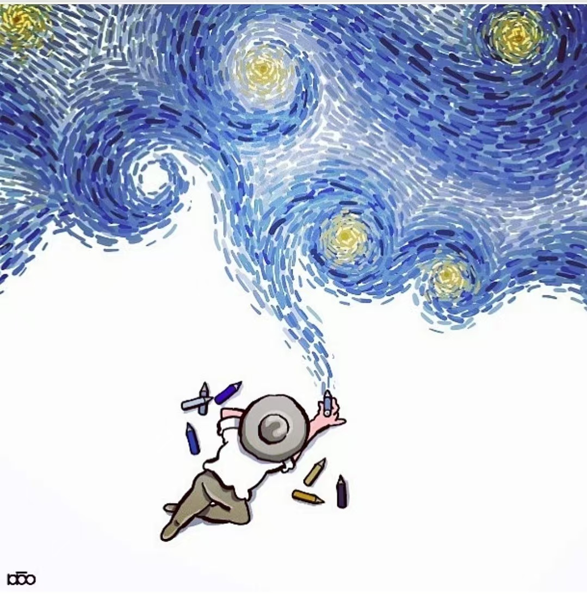

# EMSA-secret-base

  

 
本基地收集了EMSA视觉部历届的优秀作品，也提供设计中可能用到的素材（例如HUST地标建筑图案、IP形象等）和设计任务中的注意事项、需要避免的误区等。请尽情探索！

## 历届优秀作品

1.[2021年优秀作品](https://github.com/Samuels-Shi/EMSA-secret-base/tree/5edce2fcf16432a547972edc3e5bc70eb7cbebda/works%20in%202021)

2.2022年优秀作品

3.2023年优秀作品

4.2024年优秀作品
## 素材库
1.HUST地标建筑二创

2.IP形象二创
## 图片库
1.风景

2.人文
## 设计经验
1.校历制作注意事项

